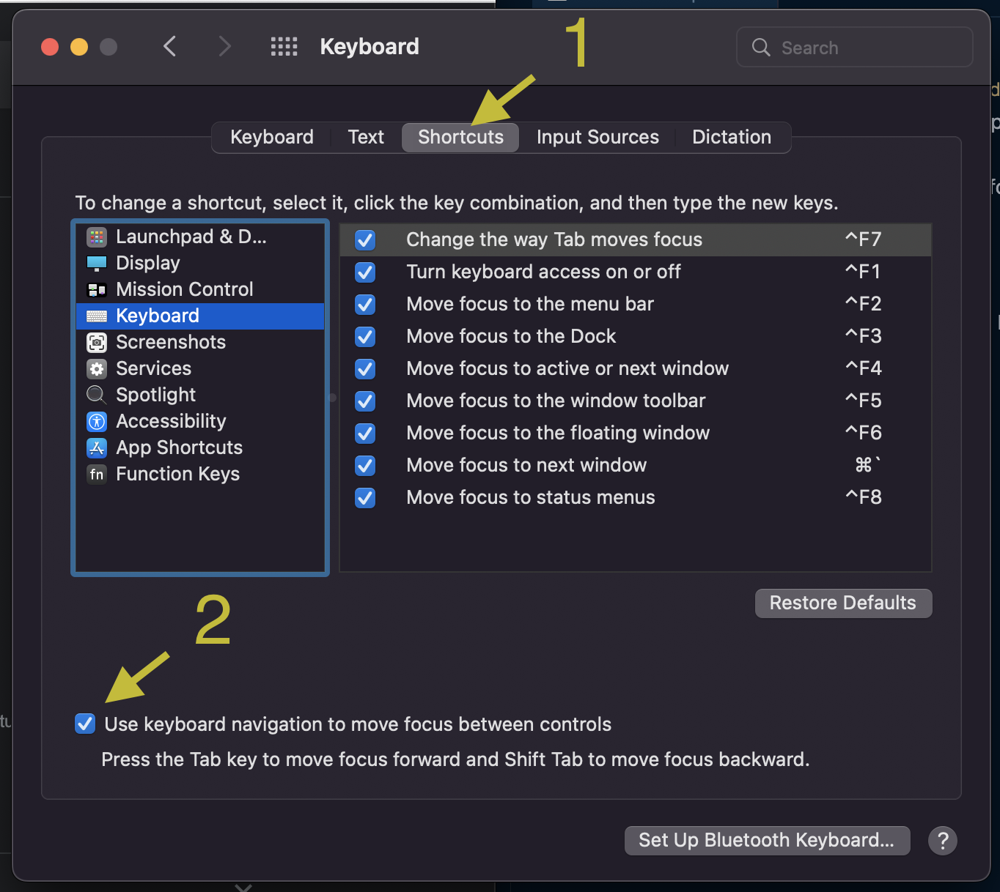

# NEW MAC SETUP 2023

## Keyboard Adjustment

Install [Karabiner Elements](https://karabiner-elements.pqrs.org/)

1. Settings > Simple Modifications. Map `caps lock` to `grave accent and tilde` and vice versa
2. Settings > Complex Modifications. Import rules. Import `Left control + hjkl to arrow keys Vim` from the internet.

## Install iTerm and Homebrew

- [Install iTerm](https://iterm2.com/)
- [Install Homebrew](https://brew.sh/)

> TIP: You can use a profile from [iterm2-profiles](./iterm2-profiles/) folder instead of manually going to configure a profile.

## Install Fira Code Font

See [Fira Code installation docs](https://github.com/tonsky/FiraCode/wiki/VS-Code-Instructions)

```bash
brew tap homebrew/cask-fonts
brew install --cask font-fira-code
```

## VS Code Theme and Paid Font

High contrast colorblind friendly theme: [Night Owl](https://marketplace.visualstudio.com/items?itemName=sdras.night-owl)
Artistic font: [Dank Mono](https://philpl.gumroad.com/l/dank-mono)

## Set up iTerm, Zsh, and plugins

Zsh is the default shell for Mac.

- Install iTerm their docs
- [Configure Terminal with Oh My Zsh!](https://engineeringfordatascience.com/posts/configure_terminal_for_data_science_with_oh_my_zsh/)

## Generate SSH Key

See more details on [Github docs](https://docs.github.com/en/authentication/connecting-to-github-with-ssh/generating-a-new-ssh-key-and-adding-it-to-the-ssh-agent)

```bash
ssh-keygen -t ed25519 -C "your_email@example.com"
```

Add it to Github and remove keys from older machines from [Github UI](https://github.com/settings/keys).

### Install NVM and Node.js

See [here](https://github.com/nvm-sh/nvm) for the latest guide

```bash
curl -o- https://raw.githubusercontent.com/nvm-sh/nvm/v0.39.3/install.sh | bash

# This will install the latest node version
nvm install node
```

Get PNPM

```bash
brew install pnpm

# Add an alias
echo 'alias p=pnpm' >> ~/.zshrc
```

## Install Visual Studio Code

Install the editor from their website. And then add the shortcut to `.zprofile` so that you can open a workspace with `code /path/to/the/workspace`.

```bash
cat << EOF >> ~/.zprofile
# Add Visual Studio Code (code)
export PATH="\$PATH:/Applications/Visual Studio Code.app/Contents/Resources/app/bin"
EOF
```

> Login with Github, and sync everything. This will bring all the settings and the extensions.

## Install Java

```bash
brew install java
echo 'export PATH="/usr/local/opt/openjdk/bin:$PATH"' >> ~/.zshrc
```

## Install Docker

From [Docker website](https://docs.docker.com/desktop/install/mac-install/)

## Install kubectl

Using Homebrew

```bash
# Use Homebrew
brew install kubectl
```

Using curl

```bash
# Or, get latest from their repo (intel processor)
curl -LO "https://dl.k8s.io/release/$(curl -L -s https://dl.k8s.io/release/stable.txt)/bin/darwin/amd64/kubectl"

## Validate
curl -LO "https://dl.k8s.io/release/$(curl -L -s https://dl.k8s.io/release/stable.txt)/bin/darwin/amd64/kubectl.sha256"

echo "$(cat kubectl.sha256)  kubectl" | shasum -a 256 --check

chmod +x ./kubectl
sudo mv ./kubectl /usr/local/bin/kubectl
sudo chown root: /usr/local/bin/kubectl
```

Check installation

```bash
# Check installation
kubectl version -o yaml
```

```bash
# Add an alias
echo 'alias k=kubectl' >> ~/.zshrc
```

## Utilities

- [Rectangle App: Window Manager](https://rectangleapp.com/)
- [Quick View Calendar](https://quickviewcalendar.com/)
- [Slack](https://slack.com/intl/en-in/downloads/mac?geocode=en-in)
- [MongoDB Compass UI](https://www.mongodb.com/try/download/compass)
- [Balsamiq Wireframe](https://balsamiq.com/wireframes/desktop/)
- [Postman](https://www.postman.com/downloads/)
- [Notion](https://www.notion.so/desktop)
- [Zoom](https://zoom.us/download)
- [Chrome](https://www.google.com/chrome/)
- [Google Drive](https://www.google.com/drive/download/)

## Finder Settings

Right click on Finder's toolbar, click `Customize Toolbar`. Remove `tags`, `spaces`, and add `new folder`.

Go to `View` > `Show Path Bar`.

Go to `Preferences`, or `⌘ + ,`

- Set new finder window to `Downloads`.
- In `Sidebar` tab, unselect all but Applications, Desktop, and Downloads. Uncheck `Recent Tags`.
- In `Advanced` tab, under "When performing a search" set it to `Search the Current Folder`.

## Keyboard shortcuts

- Settings > Keyboard > Shortcuts > Mission Control. Check `Show notification center`, press `⌘ + ⌥ + [SPACE]`

## Enable tabs in dialogs

Settings > Keyboard > Shortcuts > Check "Use keyboard navigation to move between controls"


